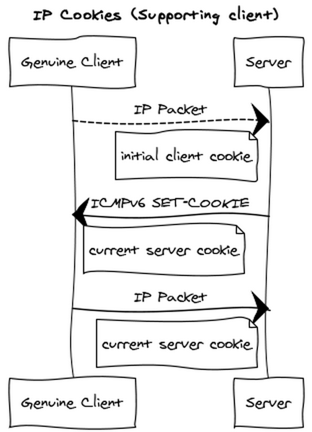
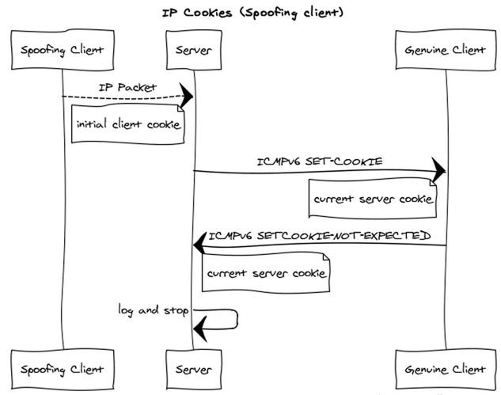
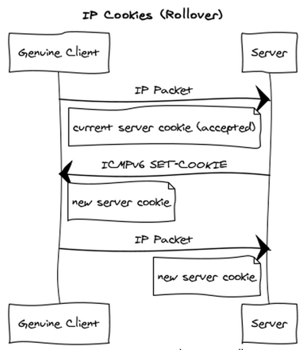

This is a proposal to allow the hosts-based mitigation of spoofed traffic,
using the old and proven mechanisms.

If the traffic is legitimate, then a single roundtrip ensures this:

If the traffic is spoofed, then the ICMP messages which are small enough, prevent
the amplification attacks to take place:

During a legitimate conversation, cookies are rolled over by issuing a new cookie 
and accepting the old cookie during a transition window

Notes:

This proposal does *not* require the traffic to be bidirectional, however
it does require the bidirectional reachability between the parties.

Also, this protocol does not take care about on-path attacks. 

The aim of the protocol is not to replace the IPSEC, but rather to allow the
safe use of datagram-based protocols which trust the source address of the request,
and protecting them from becoming amplifiers. The well-known examples of such
protocols include e.g. DNS, NTP.

The cookie format is made intentionally compatible with TCP Fast Open, to enable
potential optimizations there. The discussion of whether these optimizations *have*
to be made is outside of the scope of this work.

The protocol is not specific to IP version per se, but in this revision we focus on IPv6.
The adaptation for IPv4 should be possible and is left as a future work for this proposal.

The interaction with the middleboxes is also possible, however it is also left for future work.

